# despr2_3_docker
> Práctica de contenedores docker
0. Previo: 
    + Creación y configuración de la mv: 
    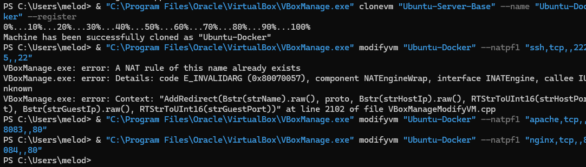
    + Creamos la estructura con Apache y Nginx
    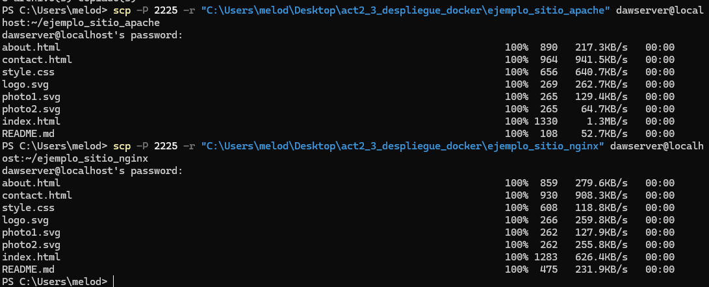

1. Docker desde la maquina virtual:
    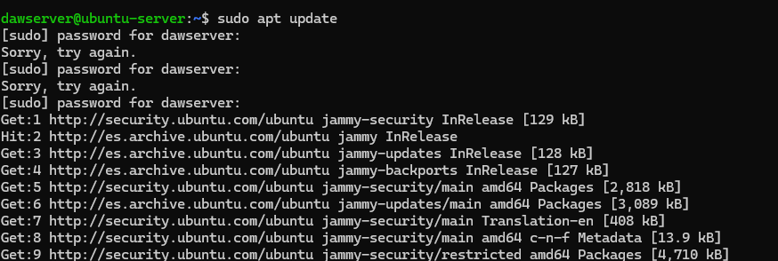
    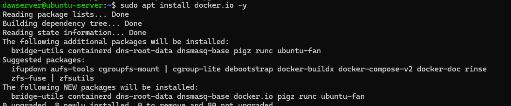
    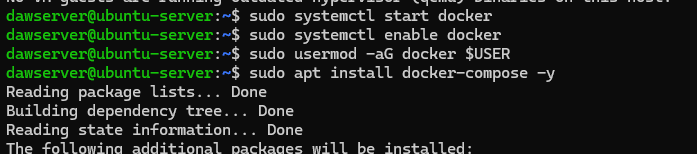
    
    > Cerramos sesion y volvemos a entra (no dio ningún problema)

2. Levantar Apache y Nginx con docker: 
    + Primero Apache: 
    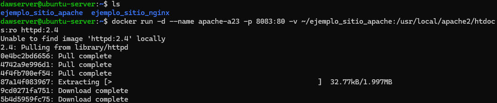
    + Ahora el de Nginx:
    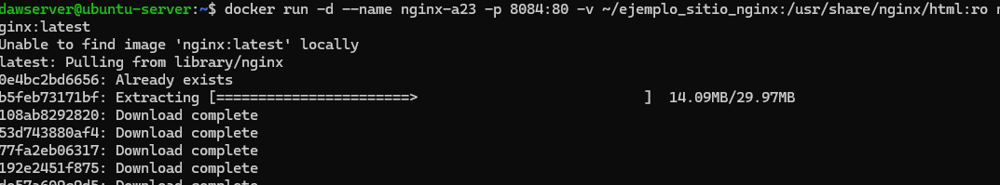

3. Comprobación de que están corriendo: 
    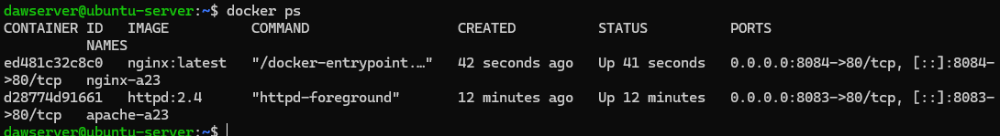

4. Docker Compose: 
    + Creación del docker compose: 
    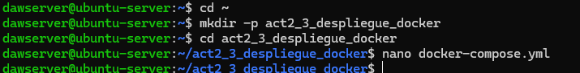
    
    > Paramos y eliminamos los contenedores creados de docker run: 
    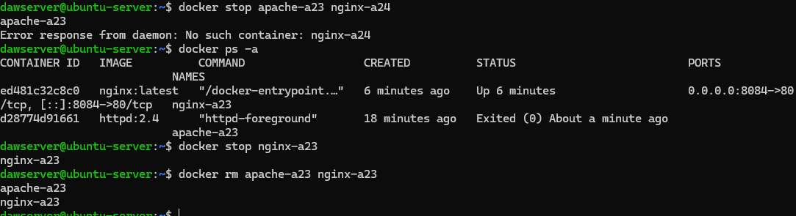
    + Después de haber creado el archivo: 
    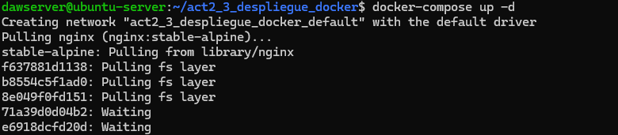
A partir de aquí no pude seguir con la tarea ya que los tiempos de respuesta eran muy largos y me daba error, a continuación dejo los errores que me daba y la comprobación de que google hacían ping:
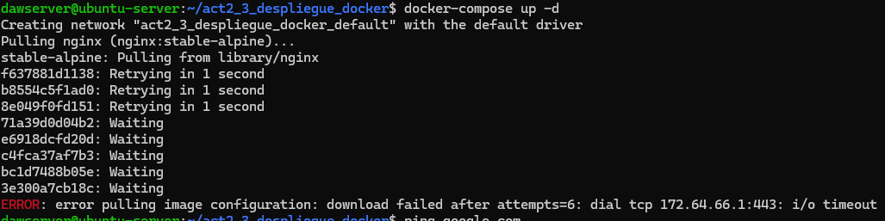
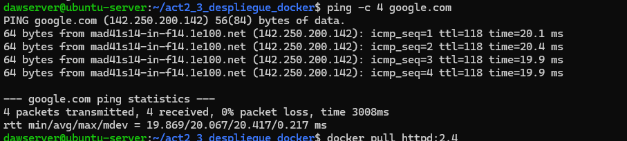

## Problemas encontrados y su solución
El único problema que encontré fue el anterior, la verdad es que no encontré forma de que me funcionará, busqué en varios sitios y me decían de configuraciones del proxy y firewall, pero aún así los tiempos eran largos y me daba el mismo error, no sé si será por mi internet o el motivo. 

